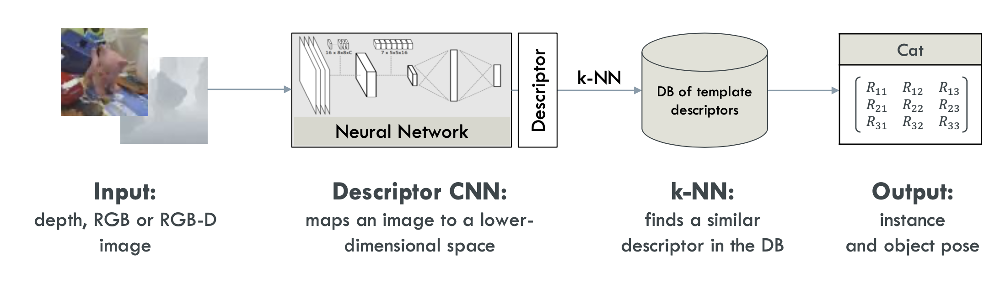
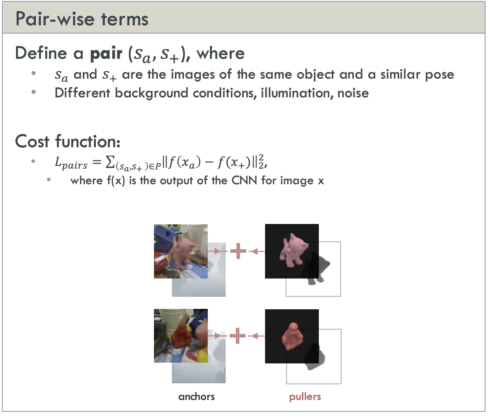
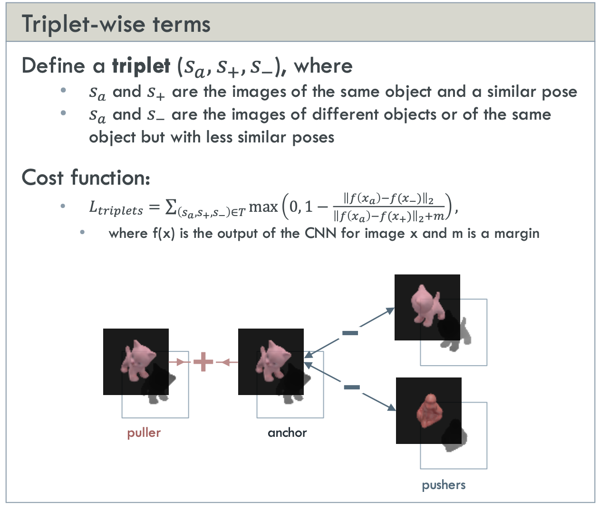

# EXERCISE 3: 3D OBJECT INSTANCE RECOGNITION AND POSE ESTIMATION

Classify and estimate a 3D pose of the object given its RGB, Depth, or RGB-D image  

Approach should be extensible and work on a large number of objects

# METHOD

